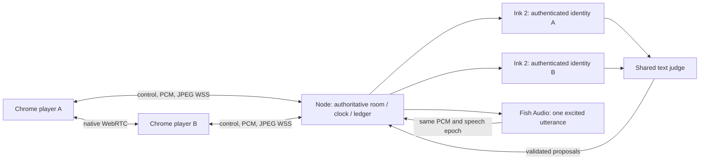

# Hear Me Out

Two friends, one ridiculous argument, and the Honorable Bonk: a mischievous toy-gavel judge who scores what was actually said and challenges a friend to answer it.

A desktop Chrome party game with prominent live faces, microphone checks, four-digit rooms, a procedural Three.js courtroom, free-form topics, live justified scores, shared judge speech, best-of-three matches, and rematch.

## Run

Requires Node 22.12+ and pnpm. No LiveKit or managed media account is used.

```sh
pnpm install
cp .env.example .env
# Set OPENAI_API_KEY, CARTESIA_API_KEY, and FISH_AUDIO_API_KEY in .env or the server environment.
pnpm build
pnpm start
```

Open `http://127.0.0.1:3000`. For remote laptops, install `cloudflared`, then run `pnpm tunnel` in another terminal. Use the HTTPS URL it prints. Keep the server laptop awake; on macOS use `caffeinate -dimsu pnpm start`. Quick Tunnel URLs are temporary and change when the tunnel restarts. The server supervisor restarts after at most three unexpected failures; active rooms are ephemeral across restarts.

`pnpm dev` runs Vite on 5173 and Node on 3000. `pnpm check`, `pnpm test`, and `pnpm build` are the normal checks. Provider verification consumes actual API usage:

```sh
pnpm verify:providers
pnpm verify:judge
# In another terminal: PORT=3001 FORCE_WSS=true pnpm exec tsx server/index.ts
pnpm verify:match
pnpm verify:idle
```

`TEST_URL` changes the match-test origin. `CHECK_MODEL` / `CHECK_REASONING` override the judge fixture model. `.env` is ignored; browser bundles contain no provider keys. Captured player recordings are off. Raw media, room state, captions, and claims live in memory and expire with the room.

## Play

Both players enter their names and the same room, enable microphones/cameras, confirm they can hear each other, and hit Ready. A server coin assigns Heads to open and Tails to choose the topic and their side. Both confirm the explicit proposition. Use headphones.

Every round offers Case → Case → Rebuttal → Rebuttal → two Closings. Heads opens odd rounds; Tails opens round two. Normal turns allow 30 active seconds, Closings 15. Closing order is trailing player first, leader second; the responder closes first when tied. “I'm done” yields immediately. Semantic handoff has an eight-second normal/four-second Closing protection and an 800 ms resumption guard. A turn's final transcripts and in-flight judging are sealed before granting the next floor.

During the debate only the floor holder's microphone is enabled and eligible for transcription. Both players are muted while judging, during shared judge speech, and during recovery. Lobby/results allow conversation; manual mute persists. Bonk makes a named handoff between opportunities, using contextual interventions at most 14 words/4.5 seconds, 15 seconds apart, twice before Closing and three times per round overall. The next player's clock opens only after playback completes or the voice recovery path finishes.

There is no early defeat. After both normal opportunities, a 4–9.75 point deficit opens a focused comeback challenge using the existing ten-point Closing budget. Points reset each round; round wins persist. First to two wins takes the match. Exact ties compare rebuttal, reasoning, impact, wit, then clarity. An exact remaining dead heat is explicitly resolved by a server coin. A stuck round aborts at 240 seconds; reconnects preserve the seat and state for 60 cumulative seconds per round. Aborts never fabricate a judged winner.

## Scoring and authority

Each opportunity caps at 10 points; each player at 30 per round. Scores use integer quarter-point units. Quality 0–4 sets a bounded target per criterion; the server commits only a positive increase over the existing target. Repeated segments, duplicates, filler, and more words cannot multiply the budget.

Rebuttal/Closing weights: reasoning 35%, rebuttal 30%, impact 20%, wit 10%, clarity 5%. Both Case opportunities use reasoning 50%, impact 30%, wit 15%, clarity 5%; neither is penalized for having no opposing argument yet. Concise complete arguments compete fairly. Accent, appearance, loudness, delivery speed, and transcript imperfections are excluded. Unsupported research is not verified evidence.

Partial/eager transcripts update captions only; only provider-final utterance segments become score evidence. The model proposes quality and a reason, never points or a winner. The server checks stable segment ownership, opportunity eligibility, round/turn IDs, sealing deadlines, quality range, and duplicate keys. One committed ledger drives both displays and results. Names, topics, and speech are untrusted data. The rubric prompt and strict schemas are in `server/providers.ts`; the rule authority is `server/game.ts`.

## Architecture



React/Vite and React Three Fiber present the game. Node/Express and `ws` serve the production app and persistent connections. Native WebRTC uses authenticated server signaling, perfect negotiation, and public STUN. No TURN service is assumed. If direct media cannot connect, both clients use independent audio/video WSS channels. Relay video is **256×144 JPEG, up to 15 fps**, quality 0.35, with at most two unacknowledged frames; only the latest pending frame is decoded onto a persistent canvas. Delayed frames remain visible rather than being rejected by age. Relay audio is 16 kHz mono PCM, captured in 20 ms frames and played through a bounded audio-thread jitter buffer. Local camera stays a live DOM video, independent of relay frames. Media warms up while direct negotiation runs. Network latency still bounds achievable response time.

Provider defaults are **Cartesia Ink 2**, **OpenAI GPT-6 Luna with no reasoning**, and **Fish Audio S2 Pro**, voice ID `29f4e37195264ebc86cf568ea6e36aff`, **1.2× speed, +4 dB volume, `[excited]` tags on every utterance**. Fish streams 16-bit mono 44.1 kHz PCM; the adapter converts it to the existing shared float-PCM playback contract. HTTP cancellation aborts generation and both clients flush the canceled speech epoch. [Fish TTS API](https://docs.fish.audio/api-reference/endpoint/openapi-v1/text-to-speech). Sol with low reasoning was integrated first, then replaced after measured 7–12 second judgments. The adapters remain replaceable. Provider quotas/access are account-dependent; STT uses two steady sessions and briefly up to four during eligibility transitions.

Source boundaries: `shared/types.ts` contracts; `server/game.ts` rules/ledger; `server/controller.ts` orchestration; `server/providers.ts` adapters/prompts; `server/index.ts` authentication/HTTP/WS; `src/client.ts` capture/transport/playback; `src/App.tsx` presentation; `src/Stage.tsx` procedural 3D.

Commands carry an idempotency ID, connection epoch, match ID, and phase version. Events carry a room sequence and complete authoritative snapshot. Stale commands/audio/provider results are rejected. Sequence gaps request a snapshot. Four-digit codes locate rooms; separate 256-bit seat tokens protect reconnects and never appear in URLs. Capacity, code collision checks, create/join/control rate limits, idle expiration, one-hour room lifetime, and provider/socket cleanup are enforced. Only one match runs concurrently on the demo server.

## Verification and limits

See [demo and verification notes](docs/DEMO.md) for observed checks, measured limitations, the demo script, and fallback. A synthetic-audio integration test is distinct from a real two-laptop match. The user confirmed the updated relay audio/video works properly on two laptops; full human-match verification is tracked separately.

Current concessions: temporary laptop/Quick Tunnel hosting; low-resolution relay video; no music bed/share image/extra modes. Captions, camera-off initials, mute controls, reduced motion, and adaptive DPR/shadows are available. The 60 fps rendering target and requested end-to-end p95 judge latency have not been established across typical laptops/networks.

Production work remaining: stable persistent hosting with TURN, durable room/ledger recovery, provider quota and abuse management, retention review, and measured browser/network/load coverage. Quick Tunnel hosting is a hackathon demo, not a production availability guarantee.
